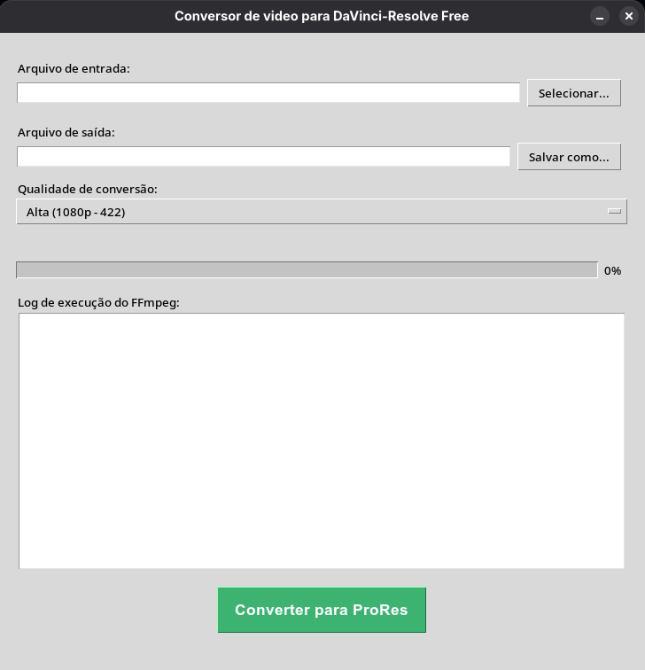

# 🔄 davinci-resolve-converter

**davinci-resolve-converter** é uma ferramenta simples e intuitiva com interface gráfica para converter vídeos em formatos totalmente compatíveis com a versão gratuita do DaVinci Resolve.

Esse aplicativo foi desenvolvido para resolver problemas comuns de incompatibilidade de codecs que causam a temida tela preta no DaVinci Resolve Free, garantindo que seus arquivos possam ser importados e editados sem complicações.

---

## Funcionalidades principais:

- Conversão rápida e direta para o codec ProRes, amplamente aceito pelo DaVinci Resolve gratuito.
- Perfis de qualidade personalizáveis (proxy, LT, 422, HQ).
- Barra de progresso e log detalhado para acompanhar a conversão em tempo real.
- Interface amigável para usuários iniciantes e avançados.

</br>

### App davinci-resolve-converter:  
  

## Pré-requisitos


Para rodar o **davinci-resolve-converter** em sistemas Linux, você precisará ter os seguintes pacotes instalados:

---

### - **Python 3** (recomendado: versão 3.6 ou superior)

</br>

  - Ubuntu / Debian:
    ```bash
    sudo apt update
    sudo apt install python3 python3-pip

  - Fedora:
    ```bash
    sudo dnf install python3 python3-pip

  - Arch Linux:
    ```bash
    sudo pacman -S python python-pip

  - OpenSuse:
    ```bash
    sudo zypper install python3 python3-pip

</br>
</br>
    

### - **Tkinter** (biblioteca gráfica para Python)  

</br>

  - Ubuntu/Debian:  
    ```bash
    sudo apt install python3-tk
    ```  
  - Fedora:  
    ```bash
    sudo dnf install python3-tkinter
    ```  
  - Arch Linux:  
    ```bash
    sudo pacman -S tk
    ```

  - OpenSuse:  
    ```bash
    sudo zypper install python3-tk
    ```  


</br>
</br>

### - **FFmpeg** (ferramenta para conversão e processamento de vídeo)

</br>

  - Ubuntu/Debian:  
    ```bash
    sudo apt install ffmpeg
    ```  
  - Fedora:  
    ```bash
    sudo dnf install ffmpeg
    ```  
  - Arch Linux:  
    ```bash
    sudo pacman -S ffmpeg
    ```

</br>

---

</br>

### Observações

- O script é baseado em Python com interface gráfica Tkinter, então o usuário precisa executar o arquivo `.py` com o Python.  
- Certifique-se que o FFmpeg está instalado e disponível no PATH do sistema para que o programa funcione corretamente.  
- A instalação de Tkinter é necessária para que a interface gráfica funcione.

</br>

---

</br>

## 🔧 Como executar o davinci-resolve-converter

1. **Baixe** o arquivo `davinci-resolve-converter.py` disponível neste repositório.

2. **Abra um terminal** na pasta onde o arquivo foi salvo. Você pode fazer isso clicando com o botão direito na pasta e escolhendo "Abrir no terminal" (ou equivalente).

3. **Execute o script com Python 3**:

   ```bash
   python3 davinci-resolve-converter.py

</br>

💡 Caso sua distribuição use apenas `python` ao invés de `python3`, o comando abaixo também pode funcionar:
  
```bash
python davinci-resolve-converter.py
```
</br>

Ao rodar o comando, a interface gráfica do conversor será aberta, pronta para uso.

